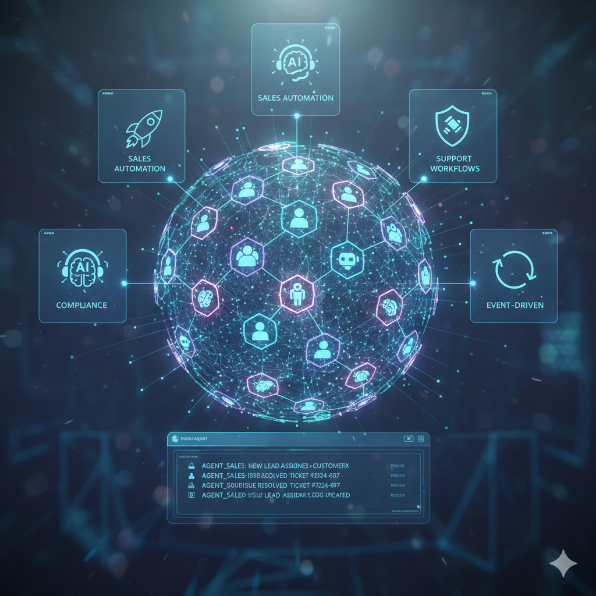

<div align="center">

# 🚀 Multi-Agent Enterprise CRM

### **AI-Native • Event-Driven • Multi-Tenant • Open Source**

[](https://choosealicense.com/licenses/mit/)
[](https://www.docker.com/)
[](https://kubernetes.io/)
[](https://www.typescriptlang.org/)
[](https://www.python.org/)
[](https://nextjs.org/)
[]()

<br/>



**A production-grade, AI-native CRM system where intelligent agents work alongside humans to automate sales, support, and compliance workflows.**

[Features](#-features) •
[Architecture](#%EF%B8%8F-architecture) •
[Quick Start](#-quick-start) •
[AI Agents](#-ai-agents) •
[Documentation](#-documentation) •
[Contributing](#-contributing)

</div>

---

## ✨ Features

<table>
<tr>
<td width="50%">

### 🤖 AI-Native Design
- **Autonomous Agents** - AI agents as first-class system actors
- **LangGraph Orchestration** - Sophisticated agent workflows
- **Ollama Integration** - Local LLM powered by Llama 3.1
- **Vector Search** - Semantic search with Weaviate

</td>
<td width="50%">

### 🔄 Event-Driven Architecture
- **Apache Kafka** - Real-time event streaming backbone
- **Event Replay** - Full audit trail and time-travel debugging
- **CQRS Pattern** - Optimized read/write separation
- **Async Processing** - Non-blocking, scalable workflows

</td>
</tr>
<tr>
<td width="50%">

### 🔐 Enterprise Security
- **Multi-Tenant Isolation** - Row-Level Security (RLS)
- **Zero Trust Architecture** - Policy-based access control
- **OPA Integration** - RBAC + ABAC policies
- **Keycloak SSO** - Enterprise authentication

</td>
<td width="50%">

### 👥 Human-in-the-Loop
- **Approval Workflows** - Human oversight for high-risk actions
- **Explainable AI** - Transparent agent decision-making
- **Reversible Actions** - All AI actions are auditable
- **Governance Dashboard** - Monitor AI behavior in real-time

</td>
</tr>
</table>

---

## 🏗️ Architecture

```
┌─────────────────────────────────────────────────────────────────────────────┐
│                          🌐 PRESENTATION LAYER                               │
│  ┌─────────────────────────────────────────────────────────────────────┐    │
│  │                    Next.js 14 + Tailwind CSS                         │    │
│  │         Real-time Dashboard • WebSocket Updates • SSR/SSG            │    │
│  └─────────────────────────────────────────────────────────────────────┘    │
└───────────────────────────────────┬─────────────────────────────────────────┘
                                    │
                                    ▼
┌─────────────────────────────────────────────────────────────────────────────┐
│                          🚪 API GATEWAY LAYER                                │
│  ┌─────────────────────────────────────────────────────────────────────┐    │
│  │              Node.js + Express + TypeScript                          │    │
│  │    Authentication • Rate Limiting • Request Routing • Caching        │    │
│  └─────────────────────────────────────────────────────────────────────┘    │
└───────────────────────────────────┬─────────────────────────────────────────┘
                                    │
                    ┌───────────────┼───────────────┐
                    ▼               ▼               ▼
┌───────────────────────────────────────────────────────────────────────────────┐
│                         ⚙️ CORE SERVICES LAYER                                 │
│  ┌──────────────┐ ┌──────────────┐ ┌──────────────┐ ┌──────────────┐         │
│  │   Leads      │ │   Deals      │ │   Tickets    │ │  Customers   │         │
│  │   Service    │ │   Service    │ │   Service    │ │  Service     │         │
│  │  (FastAPI)   │ │  (FastAPI)   │ │  (FastAPI)   │ │  (FastAPI)   │         │
│  └──────────────┘ └──────────────┘ └──────────────┘ └──────────────┘         │
└───────────────────────────────────┬───────────────────────────────────────────┘
                                    │
                                    ▼
┌───────────────────────────────────────────────────────────────────────────────┐
│                          🧠 AI AGENT LAYER                                     │
│  ┌──────────────┐ ┌──────────────┐ ┌──────────────┐ ┌──────────────┐         │
│  │    Sales     │ │   Support    │ │  Compliance  │ │  Analytics   │         │
│  │    Agent     │ │    Agent     │ │    Agent     │ │    Agent     │         │
│  └──────────────┘ └──────────────┘ └──────────────┘ └──────────────┘         │
│                        LangGraph + Ollama (Llama 3.1)                         │
└───────────────────────────────────┬───────────────────────────────────────────┘
                                    │
                                    ▼
┌───────────────────────────────────────────────────────────────────────────────┐
│                       📡 EVENT STREAMING LAYER                                 │
│  ┌─────────────────────────────────────────────────────────────────────┐     │
│  │                    Apache Kafka (KRaft Mode)                         │     │
│  │         Lead Events • Deal Events • Ticket Events • Agent Actions    │     │
│  └─────────────────────────────────────────────────────────────────────┘     │
└───────────────────────────────────────────────────────────────────────────────┘
                                    │
                                    ▼
┌───────────────────────────────────────────────────────────────────────────────┐
│                        💾 DATA & INFRASTRUCTURE                                │
│  ┌─────────────┐ ┌─────────────┐ ┌─────────────┐ ┌─────────────────────┐     │
│  │ PostgreSQL  │ │    Redis    │ │  Weaviate   │ │        OPA          │     │
│  │   16 + RLS  │ │   (Cache)   │ │  (Vectors)  │ │  (Policy Engine)    │     │
│  └─────────────┘ └─────────────┘ └─────────────┘ └─────────────────────┘     │
└───────────────────────────────────────────────────────────────────────────────┘
```

---

## 🚀 Quick Start

### Prerequisites

| Requirement | Version |
|-------------|---------|
| Docker & Docker Compose | Latest |
| Node.js | 20+ |
| Python | 3.11+ |
| Git | Latest |

### 🐳 One-Command Setup

```bash
# Clone the repository
git clone https://github.com/Mrgig7/ai-test-engineer-agent.git
cd ai-test-engineer-agent

# Copy environment configuration
cp .env.example .env

# Launch the entire stack
docker-compose up -d

# Run database migrations
docker-compose exec gateway npx prisma migrate dev

# Seed initial data
docker-compose exec gateway npm run seed
```

### 🌐 Access Points

| Service | URL | Credentials |
|---------|-----|-------------|
| **Frontend** | http://localhost:3000 | - |
| **API Gateway** | http://localhost:4000 | - |
| **Kafka UI** | http://localhost:8080 | - |
| **Grafana** | http://localhost:3001 | admin / admin |
| **Keycloak** | http://localhost:8081 | admin / admin |
| **Weaviate** | http://localhost:8082 | - |
| **OPA** | http://localhost:8181 | - |

---

## 🤖 AI Agents

Our AI agents are built using **LangGraph** for orchestration and **Ollama** running **Llama 3.1** locally for inference.

<table>
<tr>
<td align="center" width="25%">

### 💼 Sales Agent
**Lead Qualification & Scoring**

- Analyzes lead behavior
- Predicts conversion probability
- Suggests next-best-action
- Automates follow-ups

</td>
<td align="center" width="25%">

### 🎧 Support Agent
**Intelligent Ticket Triage**

- Auto-categorizes tickets
- Suggests resolutions
- Routes to specialists
- Tracks SLA compliance

</td>
<td align="center" width="25%">

### ⚖️ Compliance Agent
**Policy Enforcement**

- Validates data policies
- Risk assessment
- Audit trail generation
- Regulatory compliance

</td>
<td align="center" width="25%">

### 📊 Analytics Agent
**Business Intelligence**

- Trend analysis
- Anomaly detection
- Predictive insights
- Report generation

</td>
</tr>
</table>

### Agent Architecture

```python
# agents/src/orchestrator/router.py
async def route(self, topic: str, message: str):
    """Route events to appropriate agents based on topic."""
    agent = self.agent_registry.get(topic)
    if agent:
        result = await agent.process(message)
        await self._publish_result(result)
```

---

## 🛠️ Technology Stack

### Application Layer

| Component | Technology | Purpose |
|-----------|------------|---------|
| Frontend | **Next.js 14** + Tailwind CSS | Modern React framework with SSR |
| API Gateway | **Node.js** + Express + TypeScript | Request routing, auth, rate limiting |
| Core Services | **FastAPI** + Python 3.11 | High-performance microservices |
| AI Engine | **LangGraph** + Ollama | Agent orchestration + local LLM |

### Data Layer

| Component | Technology | Purpose |
|-----------|------------|---------|
| Primary DB | **PostgreSQL 16** | Transactional data + RLS |
| Cache | **Redis 7** | Session, cache, rate limiting |
| Vector Store | **Weaviate** | Semantic search, embeddings |
| ORM | **Prisma** | Type-safe database access |

### Infrastructure

| Component | Technology | Purpose |
|-----------|------------|---------|
| Messaging | **Apache Kafka** (KRaft) | Event streaming, no Zookeeper |
| Auth | **Keycloak** | SSO, OAuth2, OIDC |
| Policy Engine | **Open Policy Agent** | RBAC + ABAC policies |
| Container | **Docker** + Kubernetes | Deployment & orchestration |

### Observability

| Component | Technology | Purpose |
|-----------|------------|---------|
| Metrics | **Prometheus** | Time-series metrics |
| Visualization | **Grafana** | Dashboards & alerts |
| Logging | **Loki** | Log aggregation |
| Tracing | **OpenTelemetry** | Distributed tracing |

---

## 📁 Project Structure

```
multi-agent-enterprise-crm/
│
├── 📱 frontend/                 # Next.js 14 Application
│   ├── src/
│   │   ├── app/                # App Router pages
│   │   ├── components/         # React components
│   │   ├── hooks/              # Custom hooks
│   │   └── styles/             # Global styles
│   └── package.json
│
├── 🚪 gateway/                  # API Gateway (Node.js)
│   ├── src/
│   │   ├── middleware/         # Auth, validation, rate-limit
│   │   ├── routes/             # API endpoints
│   │   ├── services/           # Business logic
│   │   └── utils/              # Helper functions
│   └── prisma/                 # Database schema
│
├── 🤖 agents/                   # AI Agent Layer
│   ├── src/
│   │   ├── agents/             # Individual agent implementations
│   │   └── orchestrator/       # Event routing & coordination
│   └── tests/                  # Agent tests
│
├── 📋 policies/                 # OPA Policies
│   ├── agents/                 # Agent-specific policies
│   └── common/                 # Shared policies
│
├── 🗄️ database/                 # Database Management
│   ├── init/                   # Initialization scripts
│   └── prisma/                 # Prisma schema & migrations
│
├── 📊 observability/            # Monitoring Configuration
│   ├── grafana/                # Grafana dashboards
│   └── prometheus.yml          # Prometheus config
│
├── 🚀 deploy/                   # Deployment Configs
│   └── helm/                   # Kubernetes Helm charts
│
├── 🐳 docker-compose.yml        # Local development stack
├── 📄 .env.example              # Environment template
└── 📖 README.md                 # You are here!
```

---

## 🔒 Security Features

<table>
<tr>
<td width="50%">

### 🛡️ Authentication & Authorization
- **Keycloak SSO** - Enterprise-grade identity management
- **JWT Tokens** - Stateless authentication
- **OAuth2 / OIDC** - Standard protocols
- **Multi-factor Auth** - Enhanced security

</td>
<td width="50%">

### 🔐 Data Protection
- **Row-Level Security** - Tenant isolation at DB level
- **Encryption at Rest** - Secure data storage
- **TLS Everywhere** - Encrypted communications
- **Secrets Management** - Secure credential handling

</td>
</tr>
<tr>
<td width="50%">

### 📜 Policy Engine
- **Open Policy Agent** - Declarative access control
- **RBAC** - Role-Based Access Control
- **ABAC** - Attribute-Based Access Control
- **Policy-as-Code** - Version-controlled security policies

</td>
<td width="50%">

### 🔍 AI Governance
- **Human-in-the-Loop** - Approval for high-risk actions
- **Full Audit Trail** - Every AI decision is logged
- **Explainability** - Understand why AI made decisions
- **Reversible Actions** - Undo AI operations

</td>
</tr>
</table>

---

## 📊 CRM Services

### Leads Management
- **Lead Capture** - Multi-channel lead ingestion
- **Smart Scoring** - AI-powered lead qualification
- **Pipeline View** - Visual lead progression
- **Automated Nurturing** - AI-triggered campaigns

### Deals Pipeline
- **Stage Management** - Customizable deal stages
- **Forecasting** - AI predictive analytics
- **Collaboration** - Team deal tracking
- **Win/Loss Analysis** - Pattern recognition

### Support Tickets
- **Omnichannel Support** - Email, chat, phone unified
- **SLA Tracking** - Automated compliance monitoring
- **Knowledge Base** - AI-suggested articles
- **Escalation Workflows** - Smart routing

### Customer 360
- **Unified Profile** - Complete customer view
- **Segmentation** - Dynamic customer groups
- **Lifetime Value** - Predictive CLV scoring
- **Churn Prediction** - Proactive retention

---

## 🧪 Development

### Local Development

```bash
# Start infrastructure services
docker-compose up -d postgres redis kafka

# Start frontend (in separate terminal)
cd frontend && npm install && npm run dev

# Start gateway (in separate terminal)
cd gateway && npm install && npm run dev

# Start agents (in separate terminal)
cd agents && pip install -r requirements.txt && python -m src.orchestrator.main
```

### Running Tests

```bash
# Gateway tests
cd gateway && npm test

# Agent tests
cd agents && pytest

# Frontend tests
cd frontend && npm test
```

### Code Quality

```bash
# Linting
npm run lint

# Type checking
npm run type-check

# Format code
npm run format
```

---

## 📚 Documentation

| Document | Description |
|----------|-------------|
| [SETUP_GUIDE.md](./SETUP_GUIDE.md) | Detailed installation instructions |
| [API Documentation](./docs/api.md) | REST API reference |
| [Agent Development](./docs/agents.md) | Building custom agents |
| [Policy Guide](./docs/policies.md) | OPA policy configuration |

---

## 🤝 Contributing

We welcome contributions! Please see our contributing guidelines:

1. **Fork** the repository
2. **Create** your feature branch (`git checkout -b feature/AmazingFeature`)
3. **Commit** your changes (`git commit -m 'Add some AmazingFeature'`)
4. **Push** to the branch (`git push origin feature/AmazingFeature`)
5. **Open** a Pull Request

---

## � Project Status

> [!IMPORTANT]
> **This project is currently under active development.** Some features may be incomplete or subject to change. We welcome contributions and feedback!

---

## 🔮 Future Scope

| Timeline | Feature | Description |
|----------|---------|-------------|
| **Q2 2026** | Multi-LLM Support | Integration with GPT-4, Claude, Gemini for flexible AI backends |
| **Q3 2026** | Advanced Analytics Dashboard | Real-time business intelligence with custom reporting |
| **Q4 2026** | Mobile Application | Cross-platform mobile app using React Native |
| **Q1 2027** | Agent Marketplace | Community marketplace for sharing and discovering custom agents |
| **Q2 2027** | Voice Interface | Natural language voice commands for hands-free CRM operations |
| **Q3 2027** | Workflow Automation Studio | Visual drag-and-drop workflow builder |

---

## 📄 License

This project is licensed under the **MIT License** - see the [LICENSE](LICENSE) file for details.

---

<div align="center">

### ⭐ Star this repo if you find it helpful!

**Built with ❤️ by the AI Test Engineer Agent Team**

[Report Bug](https://github.com/Mrgig7/ai-test-engineer-agent/issues) •
[Request Feature](https://github.com/Mrgig7/ai-test-engineer-agent/issues) •
[Discussions](https://github.com/Mrgig7/ai-test-engineer-agent/discussions)

</div>
